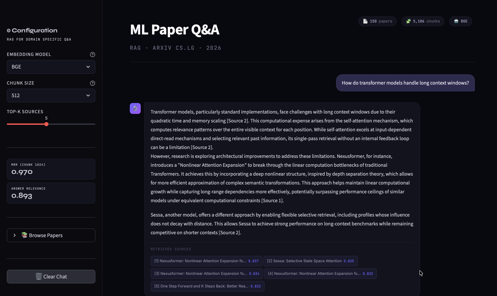
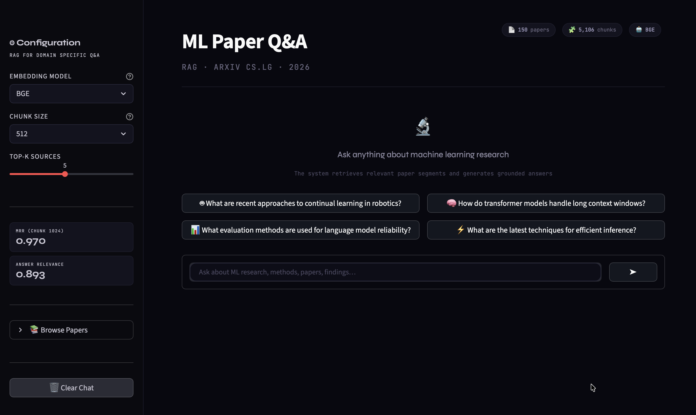

# arXiv-rag

<div align="center">

[](https://python.org)
[](https://streamlit.io)
[](https://faiss.ai)
[](https://aistudio.google.com)
[](https://developer.apple.com/metal/pytorch/)
[](LICENSE)

**Semantic question answering over 150 arXiv ML papers.**  
**Ask anything. Get grounded answers from real papers.**

[Demo](#demo) · [Quick Start](#quick-start) · [Results](#benchmark-results) · [Architecture](#architecture) · [Structure](#project-structure)

</div>

---



---

## Overview

`arXiv-rag` is a production-structured Retrieval-Augmented Generation pipeline that answers
questions about machine learning research by retrieving semantically relevant passages from
a 150-paper arXiv corpus and generating grounded answers via Google Gemini.

The project also serves as a **benchmark** — empirically comparing three transformer embedding
models against a BM25 sparse retrieval baseline across chunk sizes, retrieval depths, and
generation quality metrics using a reusable paper-specific QA evaluation set.

```
You ask → BGE encodes query → FAISS finds top-5 passages → Gemini answers with citations
```

---

## Demo

| Welcome screen | Live answer with sources |
|---|---|
|  |  |

```bash
streamlit run app.py
```

Switch between BM25, MiniLM, MPNet, and BGE live. Every answer shows retrieved paper titles
and similarity scores. Browse all 150 papers from the sidebar.

---

## Benchmark Results

Evaluated on a **100-question paper-specific QA set** stored in `data/manual_qa.json`.
The current benchmark uses **100 retrieval questions** and **30 generation questions**.
Relevance is defined at paper level across all chunk sizes.

### Retrieval · chunk size 512

| Model | MRR@5 | Precision@5 | Recall@10 | Latency |
|-------|-----|-------------|-----------|---------|
| **BGE** ⭐ | **0.990** | **0.950** | **0.341** | 31.38 ms |
| BM25 (baseline) | 0.978 | 0.862 | 0.293 | 11.67 ms |
| MiniLM | 0.975 | 0.872 | 0.302 | **6.84 ms** ⚡ |
| MPNet | 0.917 | 0.864 | 0.302 | 19.57 ms |

### Generation · chunk size 512

| Model | Answer Relevance | Faithfulness | Context Precision |
|-------|-----------------|--------------|------------------|
| **BGE** ⭐ | **0.912** | 0.989 | **1.000** |
| MiniLM | 0.728 | **0.997** | 0.987 |
| MPNet | 0.719 | 0.995 | 0.987 |
| BM25 (baseline) | 0.125 | 0.986 | **1.000** |

**Key findings:**
- BGE is still the strongest overall retriever at 512 tokens, posting the best `MRR@5`, `Precision@5`, and `Recall@10`
- MiniLM remains the best latency/quality trade-off at 512 tokens: `MRR@5 = 0.975` in `6.84 ms`, about 4.6× faster than BGE
- BM25 stays highly competitive as a sparse baseline and is especially strong at 1024 tokens (`MRR@5 = 0.990` in `4.63 ms`), so dense retrieval does not dominate every setting
- BGE is the strongest generator by answer relevance (`0.912`), while all four retrievers now show very high faithfulness/context precision under the deterministic generation setup

---

## Architecture

```
arXiv API (150 papers)
       │
       ▼
  rag/data/collector.py
  PyMuPDF  →  plain text  →  cleaning
       │
       ▼
  rag/processing/chunker.py
  Recursive chunker (256 / 512 / 1024 tokens, 64-token overlap)
       │
       ├──────────────────────────────────────────┐
       ▼                                          ▼
  rag/retrieval/embeddings.py          rag/retrieval/bm25.py
  SentenceTransformer                  Okapi BM25
  MPS / CUDA / CPU auto-detect         log-normalised scores
  L2-normalised vectors
       │
       ▼
  rag/retrieval/vector_store.py
  FAISS IndexFlatIP  (exact cosine)
       │
       └──────────────┬───────────────────────────┘
                      ▼
               Top-K passages
                      │
                      ▼
          rag/generation/generator.py
          Gemini 2.5 Flash Lite
          Token-bucket rate limiter
                      │
                      ▼
            Grounded answer + citations
```

---

## Project Structure

```
arXiv-rag/
│
├── app.py                        # Streamlit UI — entry point
├── main.py                       # CLI demo   — entry point
├── requirements.txt
├── .env.example
├── .gitignore
├── LICENSE
├── README.md
│
├── rag/                          # Core package
│   ├── __init__.py
│   ├── config.py                 # All settings: models, paths, device, API
│   │
│   ├── data/
│   │   ├── __init__.py
│   │   └── collector.py          # arXiv API downloader with resume support
│   │
│   ├── processing/
│   │   ├── __init__.py
│   │   └── chunker.py            # PDF extraction + recursive chunker
│   │
│   ├── retrieval/
│   │   ├── __init__.py
│   │   ├── embeddings.py         # SentenceTransformer wrapper + disk cache
│   │   ├── vector_store.py       # FAISS index (build / save / load / search)
│   │   ├── dense.py              # Dense retriever (build index + search)
│   │   └── bm25.py               # BM25 sparse baseline (same interface)
│   │
│   ├── generation/
│   │   ├── __init__.py
│   │   └── generator.py          # Gemini generator + token-bucket rate limiter
│   │
│   └── evaluation/
│       ├── __init__.py
│       ├── metrics.py            # Recall@K, Precision@K, MRR@K, AR, Faithfulness
│       └── qa_generator.py       # Auto-generate QA pairs from paper content
│
├── scripts/
│   └── run_experiments.py        # Full ablation: 4 models × 3 chunk sizes → plots
│
├── data/
│   ├── metadata.json             # Paper metadata (committed — no PDFs)
│   └── manual_qa.json            # 100 benchmark QA pairs
│
├── results/
│   ├── retrieval_metrics.json
│   ├── generation_metrics.json
│   └── plots/                    # MRR@5, Precision@5, Recall@5, Latency, BM25 vs Dense
│
└── docs/
    ├── screenshot_welcome.png
    └── screenshot_qa.png
```

---

## Quick Start

### Prerequisites

- Python 3.11+
- [Google AI Studio API key](https://aistudio.google.com/app/apikey) — free tier works
- Apple Silicon (MPS), NVIDIA GPU (CUDA), or CPU

### Install

```bash
git clone https://github.com/GodVilan/arXiv-rag
cd arXiv-rag

python3 -m venv venv
source venv/bin/activate          # Windows: venv\Scripts\activate

pip3 install -r requirements.txt

cp .env.example .env
# open .env and set: GEMINI_API_KEY=AIza...
```

### Run

```bash
# 1 — Download 150 arXiv ML papers (~10 min)
python3 -c "from rag.data.collector import download_papers; download_papers()"

# 2 — Generate the 100-question evaluation set via Gemini (~10 min)
python3 rag/evaluation/qa_generator.py --n 100

# 3 — Run full benchmark: BM25 + 3 models × 3 chunk sizes (~15 min)
python3 scripts/run_experiments.py

# 4 — Launch the UI
streamlit run app.py

# 5 — Or use the CLI
python3 main.py --model BGE --top_k 5
python3 main.py --list             # browse all 150 papers
```

---

## Configuration

All settings in `rag/config.py`:

```python
# Embedding models
EMBEDDING_MODELS = {
    "MiniLM": "sentence-transformers/all-MiniLM-L6-v2",   # 384d — fast
    "MPNet":  "sentence-transformers/all-mpnet-base-v2",   # 768d — balanced
    "BGE":    "BAAI/bge-large-en",                         # 1024d — best accuracy
}

# Chunk sizes for ablation
CHUNK_SIZES  = [256, 512, 1024]    # tokens
CHUNK_OVERLAP = 64                 # overlap between consecutive chunks

# Generation
GEMINI_MODEL = "gemini-2.5-flash-lite"
GEMINI_RPM   = 12                  # free tier: 15 RPM → 12 for safety margin

# Device — auto-detected: MPS → CUDA → CPU
DEVICE = _best_device()
```

---

## Evaluation

| | |
|---|---|
| **Corpus** | 150 arXiv cs.LG papers · early 2026 |
| **Chunks** | 2,332 (1024-token) to 10,260 (256-token) |
| **QA pairs** | 100 paper-specific QA pairs in `data/manual_qa.json`; current run uses 100 for retrieval and 30 for generation |
| **Relevance** | Paper-level — all chunks from the same source paper are relevant |

| Metric | Definition |
|--------|-----------|
| MRR@K | Mean reciprocal rank of first relevant result within top-K |
| Recall@K | Fraction of all relevant (paper-level) chunks in top-K |
| Precision@K | Fraction of top-K results that are relevant |
| Latency | Avg retrieval time per query over the first 20 queries (ms) |
| Answer Relevance | Cosine similarity between question and answer embeddings |
| Faithfulness | Fraction of answer sentences supported by retrieved context |
| Context Precision | Fraction of retrieved chunks contributing to the answer |

---

## Tech Stack

| Layer | Technology |
|-------|-----------|
| PDF extraction | PyMuPDF 1.25.5 |
| Embeddings | sentence-transformers 3.0 (MiniLM · MPNet · BGE) |
| Sparse retrieval | rank-bm25 (Okapi BM25) |
| Vector index | FAISS IndexFlatIP |
| Generation | Google Gemini 2.5 Flash Lite |
| UI | Streamlit |
| Acceleration | Apple MPS · NVIDIA CUDA · CPU |

---

## License

MIT — see [LICENSE](LICENSE)
